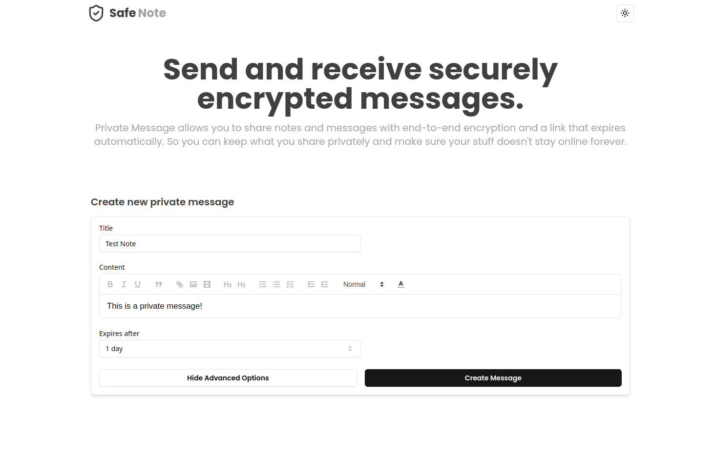
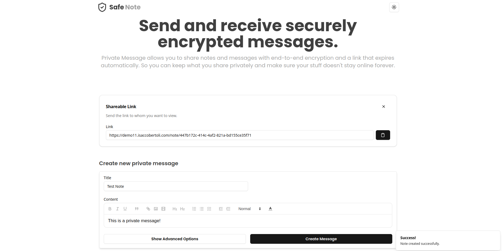
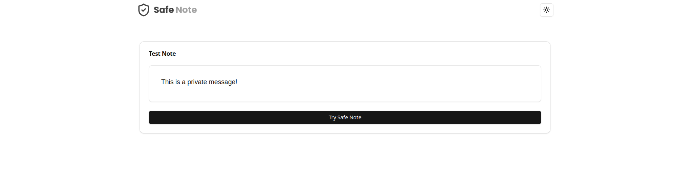
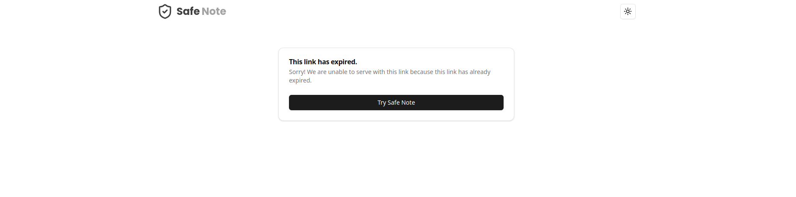

# Safe Note

- **Safe Note** is a private messaging platform that allows you to securely share notes and messages with **end-to-end encryption**. The shared content is accessed via a **link that automatically expires**, ensuring your information stays **private** and doesn't remain online **indefinitely**.
- Demo: https://demo11.isaccobertoli.com/


## Tech Stack Client

- React
- Axios
- Tailwind
- Typescript
- Shadcn UI
- React Quill


## Tech Stack Server

- Node
- Express
- Sequelize
- SQLite
- Crypto
- Cors


## Client Images

<div>
    
    
</div>

<div>
    
    
</div>


## Getting Up and Running Locally

### Clone Repo

```bash
git clone https://github.com/Isacco-B/bg-remover
```
### Client

```bash
cd client
```

- Create .env file with the following variables:

```bash
VITE_SERVER_HOST="server url"
VITE_CLIENT_HOST="client url"

```

- Install dependencies

```bash
npm install
```

- Start server

```bash
npm run dev
```

### Server

```bash
cd server
```

- Create .env file with the following variables:

```bash
NODE_ENV=development|production
PORT=3000
HOST=server url
ALLOWD_HOSTS=host1,host2,host3

```

- Install dependencies

```bash
npm install
```

- Start server

```bash
npm run dev
```

## 🔗 Links

[](https://www.linkedin.com/in/isacco-bertoli-10aa16252/)
